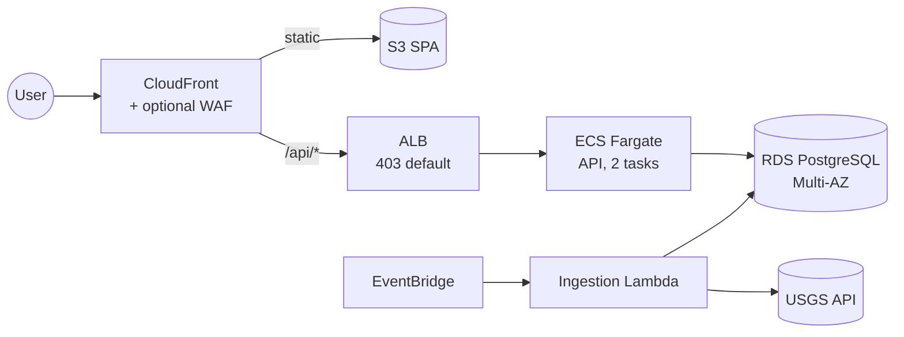

# Global Earthquake Monitoring System

[](https://github.com/ChristianOrrala/Tech-Challenge-TCGL01/actions/workflows/ci.yml)

A cloud-native system that ingests, stores, and serves global earthquake data from the USGS on AWS.
Built as a Senior/Staff SRE technical challenge, so the infrastructure and the reliability practice
around it - SLOs, alarms, runbooks, tested failure modes, and thirteen recorded architecture decisions
- are as much the deliverable as the application. Ingestion (EventBridge, Lambda), the API (ECS
Fargate, RDS PostgreSQL), and the edge (CloudFront, ALB, opt-in WAF) are all defined in Terraform and
deployable into a fresh AWS account from a clean clone.

## Live demo

<https://dj6w07ewk4m8e.cloudfront.net>

This is a demo environment for review purposes and may be torn down after the evaluation window closes.
Region `us-east-2`; edge WAF enabled with tested evidence (see `docs/evidence/`).

## Architecture



Full diagram, request/ingestion paths, network tiers, and the security model: `docs/architecture.md`.

## Quickstart

The default path is entirely local: your machine deploys straight into your AWS account, no CI and no
GitHub setup required. This is exactly how a fresh clone (or a live review in someone else's account)
comes up. Wiring GitHub Actions in is optional and covered afterwards.

Prerequisites: AWS credentials configured for the target account, Terraform >= 1.11, Docker running
(for the image build), and Python 3.12. On Windows, run `make` from Git Bash - the recipes assume a
POSIX shell.

```
git clone https://github.com/ChristianOrrala/Tech-Challenge-TCGL01.git
cd Tech-Challenge-TCGL01

make bootstrap STATE_BUCKET=<your-globally-unique-bucket-name>

cp infra/envs/demo/backend.hcl.example infra/envs/demo/backend.hcl     # fill in the bucket name
cp infra/envs/demo/demo.tfvars.example infra/envs/demo/demo.tfvars    # fill in an alert email

make init
make package-ingestion
make plan
make apply       # stands up the stack, including an (empty) ECR repository
make image       # build and push the first API image; ECS converges once it lands
make seed        # invoke ingestion once so the tables fill without waiting on the schedule
```

`make apply` finishes before any image exists, so the API service will briefly report tasks that cannot
start - expected on a fresh account. `make image` resolves it and ECS converges on its own. If the wait
between the two ran long enough that the deployment already gave up, nudge it with
`aws ecs update-service --cluster tcgl01 --service tcgl01-api --force-new-deployment` (details:
[docs/runbook.md](docs/runbook.md#fresh-account-deployment-guide)).

### Optional: hand ongoing deploys to GitHub Actions

Only useful when you own the repository and want pushes to `main` to deploy for you - not needed to
stand the stack up. Once the local apply above has run, set `AWS_DEPLOY_ROLE_ARN`, `TF_STATE_BUCKET`,
and `ALERT_EMAIL` as repository secrets and `DEPLOY_ENABLED=true` as a repository variable, then trigger
`deploy.yml`. The trust policy is federated via OIDC - no long-lived keys leave your account. Full
walkthrough, including the `enable_waf` toggle guidance:
[docs/runbook.md - fresh-account deployment guide](docs/runbook.md#fresh-account-deployment-guide).

## SLOs

| SLI | Target |
|---|---|
| API availability (canary + ALB, complementary views) | 99.9% monthly (budget ~43.2 min/month) |
| API latency (ALB p95) | < 300 ms |
| Data freshness (age of last successful ingest) | <= 10 min, 99% of the time |

Error-budget math, burn policy, RPO/RTO, and why two availability measurements are kept instead of one:
`docs/slo.md`.

## Observability

CloudWatch dashboard `tcgl01-platform` (traffic, compute, database, ingestion, alarm status in one
view); a Synthetics canary (`tcgl01-heartbeat`) probing the live URL every 5 minutes; 8 CloudWatch
alarms, all notifying one SNS topic with recovery as visible as the original page:

`tcgl01-availability-fast-burn` · `tcgl01-latency-p95` · `tcgl01-data-freshness` ·
`tcgl01-ingestion-failures` · `tcgl01-api-tasks-below-desired` · `tcgl01-rds-cpu-high` ·
`tcgl01-rds-storage-low` · `tcgl01-canary-failing`

Alarm-by-alarm meaning, first checks, and likely causes (including the real WAF-vs-canary incident this
project hit and fixed): `docs/runbook.md`.

## Security highlights

- Origin pinning: the ALB defaults to `403`; the only path to the target group requires a secret header
  only this CloudFront distribution knows, closing the residual left by the shared CloudFront-managed
  prefix list.
- IAM least privilege applied unevenly on purpose: the API's task role holds zero permissions (the app
  never calls an AWS API), while the CI deploy role's own broad grant explicitly denies modifying its
  own role or trust policy (deny-self, not an oversight). Creating new privileged roles within the
  project prefix remains possible; the production evolution is a permissions boundary applied to every
  role this identity may create.
- OIDC federation for CI: no long-lived AWS keys in GitHub; the trust policy pins the exact repository
  and branch via id-embedded subject claims.
- Defense in depth at the edge: an opt-in WAF (managed rule sets plus rate limiting) layered on top of
  the always-on network-level origin pinning, not a substitute for it.
- Nothing sensitive in code or state: the RDS master password is AWS-managed and never appears in
  Terraform HCL; Terraform state lives in a private, versioned S3 bucket, never in the repository.

Full reasoning for every decision above: `docs/adr/`.

## Cost and teardown

Roughly **3-5 USD/day** for the demo configuration (WAF on, `db.t4g.micro` Multi-AZ, 2 Fargate tasks,
one NAT gateway). Itemized estimate: [docs/runbook.md - cost](docs/runbook.md#cost).

```
make destroy
```

Buckets and the ECR repository are configured to force-delete even when non-empty, so teardown never
gets stuck - a deliberate demo-only trade-off, detailed in [docs/runbook.md - teardown](docs/runbook.md#teardown).

## Repo layout

```
Tech-Challenge-TCGL01/
├── README.md
├── Makefile
├── .github/workflows/     ci.yml, deploy.yml
├── docs/
│   ├── architecture.md
│   ├── slo.md
│   ├── runbook.md
│   ├── resilience.md
│   ├── adr/               001-013
│   └── evidence/          deployment-smoke.md
├── infra/
│   ├── main.tf, variables.tf, outputs.tf, providers.tf, versions.tf
│   ├── envs/demo/         backend.hcl.example, demo.tfvars.example
│   └── modules/
│       ├── network/       vpc, public/private/isolated subnets, nat
│       ├── database/      rds postgresql, multi-az
│       ├── api/            ecs fargate, alb, iam
│       ├── ingestion/     lambda, eventbridge schedule
│       ├── edge/           cloudfront, waf, origin pinning
│       ├── observability/ alarms, canary, dashboard
│       └── cicd/           github oidc, deploy role
├── app/
│   ├── api/                fastapi
│   └── web/                react + vite spa
└── ingestion/               lambda handler + tests
```

## Docs index

- [`docs/architecture.md`](docs/architecture.md) - overview, diagram, request/ingestion paths, network
  tiers, security model, region layout
- [`docs/slo.md`](docs/slo.md) - SLIs/SLOs, error budget, burn policy, RPO/RTO, measurement-point
  honesty
- [`docs/runbook.md`](docs/runbook.md) - deploy, rollback, alarm-by-alarm response, fresh-account
  guide, teardown, cost
- [`docs/resilience.md`](docs/resilience.md) - failure modes, graceful degradation, toil reduction
- [`docs/evidence/deployment-smoke.md`](docs/evidence/deployment-smoke.md) - real deployment evidence:
  smoke output, the alarm lifecycle during bring-up, the canary/WAF incident, the rollback drill
- `docs/adr/` - thirteen architecture decision records:
  [001](docs/adr/001-ecs-fargate-over-serverless.md) ECS Fargate over pure serverless ·
  [002](docs/adr/002-rds-postgresql-over-dynamodb.md) RDS PostgreSQL over DynamoDB ·
  [003](docs/adr/003-alb-as-api-front-door.md) ALB as the API front door, no API Gateway ·
  [004](docs/adr/004-terraform-over-cloudformation-cdk.md) Terraform over CloudFormation/CDK ·
  [005](docs/adr/005-cloudfront-edge-waf-opt-in.md) CloudFront and edge WAF, opt-in ·
  [006](docs/adr/006-origin-pinning-secret-header.md) Origin pinning, secret header ·
  [007](docs/adr/007-rolling-deploys-circuit-breaker.md) Rolling deploys with circuit breaker ·
  [008](docs/adr/008-cloudwatch-native-dashboard.md) CloudWatch-native dashboard ·
  [009](docs/adr/009-idempotent-upsert-by-event-id.md) Idempotent upsert by event id ·
  [010](docs/adr/010-oidc-ci-sha-pinned-images.md) OIDC CI, sha-pinned images ·
  [011](docs/adr/011-canary-and-alb-metrics-as-slis.md) Canary and ALB metrics as complementary SLIs ·
  [012](docs/adr/012-disable-edge-error-caching.md) Edge error-page caching disabled ·
  [013](docs/adr/013-managed-master-password.md) Managed master password
