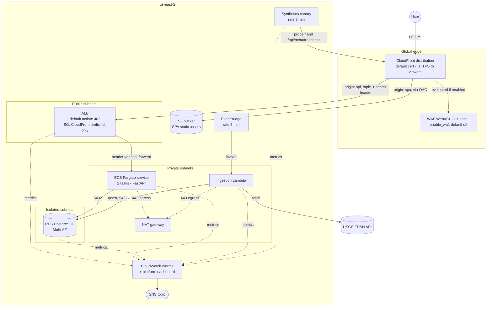

# Architecture

## Overview

The system ingests global earthquake data from the USGS on a 5-minute schedule, stores it in
PostgreSQL, and serves it to a small React dashboard through a FastAPI backend. It is built as a
technical challenge for a Senior/Staff SRE role, so the infrastructure and the reliability practice
around it (SLOs, alarms, runbooks, decision records, tested failure modes) are as much the deliverable
as the application itself.

Two paths matter: the **request path** (a browser asking for the SPA or hitting an API endpoint) and
the **ingestion path** (a scheduled job pulling new data). They share the database and the
observability plane and nothing else.

## Diagram

## Request path

A browser talks to one host: the CloudFront distribution. There is no separate API domain.

1. `GET /` resolves to the **spa** origin - a private S3 bucket, reachable only through CloudFront's
   Origin Access Control. The SPA has no client-side router - it is a single page - so the two
   `custom_error_response` blocks that rewrite 403 and 404 to `/index.html` with a 200 exist for
   S3+OAC key-miss behavior and hard refreshes of that single page, not for routing; both rewrites have
   `error_caching_min_ttl = 0` so a stale rewrite can never mask a real API failure (see
   [ADR 012](adr/012-disable-edge-error-caching.md)).
2. `GET /api/*` resolves to the **api** origin - the ALB, over plain HTTP (the ALB carries no
   certificate; viewer-to-CloudFront stays HTTPS regardless). Every request CloudFront sends this
   origin carries a secret `X-Origin-Verify` header.
3. If `enable_waf` is on, the WAF WebACL is evaluated as part of the CloudFront request before either
   origin is reached (managed rule sets plus a per-IP rate limit). See
   [ADR 005](adr/005-cloudfront-edge-waf-opt-in.md).
4. The ALB's `:80` listener has no forwarding default action - it returns a flat `403` unless a
   listener rule at priority 1 matches the `X-Origin-Verify` header, in which case it forwards to the
   API target group. See [ADR 006](adr/006-origin-pinning-secret-header.md).
5. The target group load-balances across whichever of the 2 ECS Fargate tasks are currently healthy
   (`/health`, 15s interval, 2/3 thresholds). The API queries PostgreSQL for every route except
   `/health`, which is deliberately DB-free (see `docs/resilience.md`).

## Ingestion path

1. An EventBridge rule (`rate(5 minutes)`) invokes the ingestion Lambda, in the private subnets.
2. The Lambda calls the USGS FDSN event API over the NAT gateway. On an empty table it backfills the
   last 30 days in day-sized chunks (USGS caps result size per request); otherwise it re-fetches the
   trailing 2 hours, which deliberately overlaps the previous run.
3. Every row is written with `INSERT ... ON CONFLICT (event_id) DO UPDATE` - USGS revises magnitude and
   location on recent events, so the 2-hour overlap re-applies those revisions instead of risking
   missed updates or duplicate rows. See [ADR 009](adr/009-idempotent-upsert-by-event-id.md).
4. Every run, success or failure, publishes to the `TCGL01` custom metric namespace:
   `EventsUpserted`, `IngestionFreshnessSeconds` (always `0.0` on success - see `docs/slo.md` for what
   this metric actually proves), and `IngestionSuccess` (`1.0`/`0.0`).

## Network tiers

One VPC (`10.42.0.0/16`), 2 availability zones, 3 subnet tiers:

| Tier | CIDRs | Route | Holds |
|------|-------|-------|-------|
| Public | `10.42.0.0/24`, `10.42.1.0/24` | Internet gateway | ALB, the NAT gateway's ENI |
| Private | `10.42.10.0/24`, `10.42.11.0/24` | NAT gateway | ECS API tasks, ingestion Lambda |
| Isolated | `10.42.20.0/24`, `10.42.21.0/24` | none | RDS only |

The isolated route table carries no route beyond the implicit local VPC route - RDS cannot initiate or
receive any connection that didn't originate inside the VPC, and its security group starts with zero
rules; the API and ingestion modules each attach their own scoped ingress rule to it directly (avoids a
dependency cycle between the database module and its two consumers).

A single NAT gateway serves both private subnets (one gateway, not one per AZ - a cost/complexity
trade-off called out again in `docs/resilience.md`, since it is also the one place the AZ-loss story is
incomplete).

## Security model

- **Edge WAF, opt-in.** `enable_waf` (default `false`) gates the entire WAF WebACL and its us-east-1
  provider footprint at `count = 0` - nothing declared, nothing planned, nothing billed, unless
  explicitly turned on. When on: `AWSManagedRulesCommonRuleSet`, `AWSManagedRulesKnownBadInputsRuleSet`,
  and a 2000-requests/5-minutes per-IP rate limit.
- **Prefix-list lock.** The ALB security group admits inbound `:80` only from AWS's CloudFront
  managed prefix list (`com.amazonaws.global.cloudfront.origin-facing`). That list is shared by every
  CloudFront distribution in every AWS account, so on its own it proves "came through some CloudFront
  edge," not "came through this one."
- **Origin-header pinning closes that gap.** CloudFront attaches a random 32-character value
  (generated once, never output, live only in Terraform state) as a custom header on every request to
  the ALB origin. The ALB's default listener action is `403`; only a request carrying that header
  reaches the target group. Verified directly at deploy time: hitting the ALB's own DNS name, bypassing
  CloudFront entirely, is connection-blocked at the security group before the header check is even
  reached.
- **IAM least privilege, applied unevenly on purpose:**
  - The API's ECS **task role** holds zero policies. The application never calls an AWS API, so it gets
    no permissions to call one.
  - The API's **execution role** (what ECS itself uses) gets the standard managed execution policy plus
    one inline grant scoped to exactly the one database secret this service needs.
  - The ingestion Lambda's role gets the managed VPC-access-execution policy plus two inline grants: the
    same database secret, and `PutMetricData` restricted by a `cloudwatch:namespace` condition to
    `TCGL01` alone.
  - The CI **deploy role** is the broadest identity in the stack (`PowerUserAccess`, which itself
    excludes IAM, plus a narrow inline grant restoring only enough IAM to manage this project's own
    roles and policies, name-prefixed `tcgl01-*`) - and it carries an explicit `Deny` on modifying its
    own role, policies, or trust relationship. Deny always wins over allow, so even a fully compromised
    CI run cannot modify its own role or trust policy (deny-self); creating new privileged roles remains
    possible within the project prefix, and the production evolution is a permissions boundary applied
    to every role this identity may create. See [ADR 010](adr/010-oidc-ci-sha-pinned-images.md).
- **No long-lived AWS credentials anywhere.** GitHub Actions authenticates via OIDC
  (`sts:AssumeRoleWithWebIdentity`), trust-scoped to this exact repository and branch.
- **Encryption at rest** on the database (`storage_encrypted = true`) and **nothing sensitive in
  code or state**: the RDS master credential is AWS-managed
  (`manage_master_user_password = true`, never a plaintext argument anywhere), and Terraform state
  itself lives in a private, versioned S3 bucket, never in the repository. See
  [ADR 013](adr/013-managed-master-password.md).

## High availability

Availability is built in at each tier, and the points where a one-week demo stops short of full
fault-tolerance are named rather than implied - the same honesty the failure-mode table in
`docs/resilience.md` carries, summarized here at the architecture level.

| Tier | What keeps it available | Residual at demo scope |
|------|-------------------------|------------------------|
| CloudFront | Global, AWS-managed edge network - no single point of presence to lose | None material |
| ALB | AWS-managed, spans both public subnets across the 2 AZs; self-heals within the service | None material |
| ECS API | `desired_count = 2` Fargate tasks, one per private subnet so a single-AZ loss keeps a task serving through the ALB; rolling deploys at `min_healthy = 100%` / `max = 200%` never dip capacity during a release | Two tasks, not an autoscaled fleet - sized for the demo, widens by raising the count |
| RDS | Multi-AZ: a synchronous standby in the second AZ, automatic failover on instance or AZ loss | Failover is not drilled here - the 1-2 min figure is AWS's documented range, not one this project measured (`docs/slo.md`, RPO/RTO) |
| Ingestion | EventBridge and Lambda are regional AWS-managed services, inherently multi-AZ; the pipeline is decoupled, so an ingestion outage degrades freshness without touching the read path (`docs/resilience.md`) | Shares the single NAT gateway for egress (below) |

Two deliberate gaps, stated plainly, neither an oversight:

- **One NAT gateway, not one per AZ** - the single place the AZ-loss story is incomplete: if the AZ
  holding the NAT gateway is the one lost, the surviving-AZ task and the ingestion Lambda both lose
  internet egress even while otherwise healthy. Named here, in `## Network tiers`, and in
  `docs/resilience.md`. One NAT per AZ is the production fix, at roughly double the idle NAT cost.
- **Single region.** A full us-east-2 outage is out of scope - the challenge scopes the build to one
  region, and multi-region active-passive is the production evolution, not a one-week deliverable. The
  one recovery behavior actually drilled rather than just configured is the ECS deployment circuit
  breaker: 24/24 uptime probes across a live rollback, `docs/evidence/deployment-smoke.md`.

## Region layout

Every regional resource - the VPC, ALB, ECS cluster, RDS instance, Lambda, both S3 buckets, the
CloudWatch alarms and dashboard, the Synthetics canary, the OIDC provider and deploy role - lives in
**us-east-2**, the challenge's stated constraint. CloudFront itself is a global service, not regional.

The one exception is the WAF WebACL: AWS requires CLOUDFRONT-scope WebACLs to be created through a
**us-east-1** provider regardless of where the distribution's origins live. This project implements
that with a second `aws` provider alias (`aws.us_east_1`), declared once in `infra/providers.tf` and
passed explicitly into the edge module. With `enable_waf = false` (the default), that alias exists in
the code but provisions nothing - the stack's real, deployed footprint is single-region. The demo
environment sets `enable_waf = true`, so its footprint does include the us-east-1 exception, with
evidence in `docs/evidence/deployment-smoke.md`.
